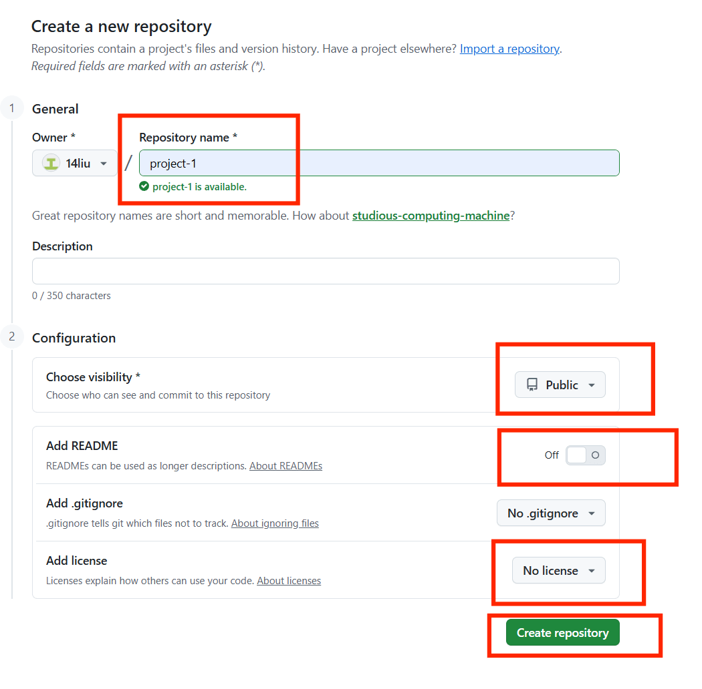
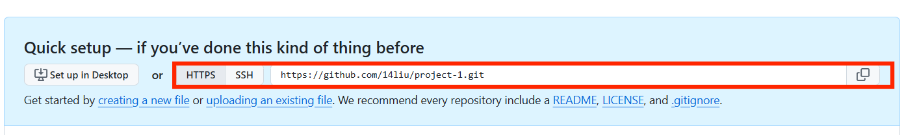
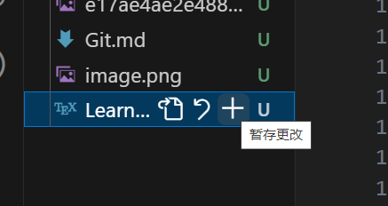
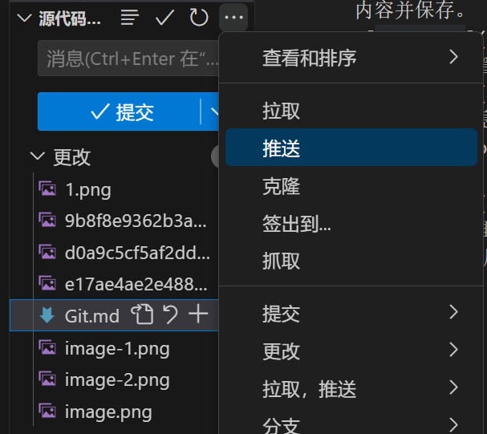

# Git实践
## 1.注册GitHub账号
访问 github.com 点击 Sign up，按提示输入邮箱、用户名和密码，完成邮箱验证后即可登录。
## 2.在vscode中创建本地Git仓库
步骤：
* 在vscode中打开一个空文件夹，如下图所示。

* 点击左侧活动栏的源代码管理，点击初始化仓库按钮，此时该文件夹即成为Git仓库。

## 2.在GitHub网页上创建空远程仓库
步骤：
* 登录GitHub，点击Create repository按钮，创建新的仓库
填写仓库名，选择 Public，不要勾选“Add README/license”等选项。

* 复制仓库地址

## 3.设置本地仓库和远程仓库关联

## 3.新建文件并上传
* 在资源管理器中新建LearningReport.tex文件写入内容并保存。

* 打开源代码管理,点击暂存更改

* 输入提交信息add LearningReport.tex点击提交。

* 点击 ... ，然后选择推送，文件即出现在 GitHub 仓库中。
