# Git实践

## 1.注册GitHub账号
访问 github.com 点击 Sign up，按提示输入邮箱、用户名和密码，完成邮箱验证后即可登录。

## 2.在vscode中创建本地Git仓库
步骤：
* 在vscode中打开一个空文件夹，如下图所示。
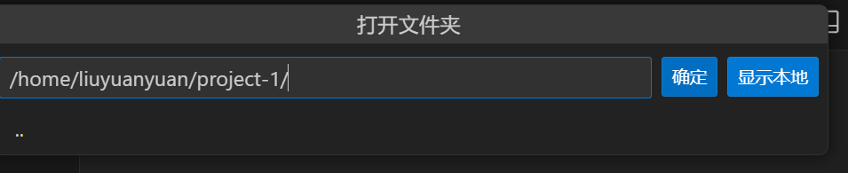
* 点击左侧活动栏的源代码管理，点击初始化仓库按钮，此时该文件夹即成为Git仓库。
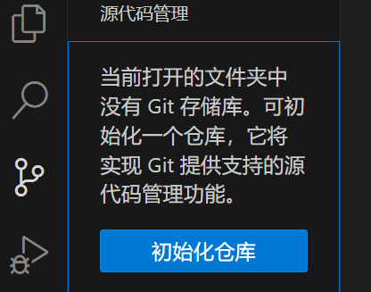

## 3.在GitHub网页上创建空远程仓库
步骤：
* 登录GitHub，点击Create repository按钮，创建新的仓库
填写仓库名，选择 Public，不要勾选“Add README/license”等选项。

* 复制仓库地址

## 4.设置本地仓库和远程仓库关联
* 使用HTTPS TLS 网络连接容易发生异常中断，事先配置了.ssh密钥对,优先切换 SSH 地址。
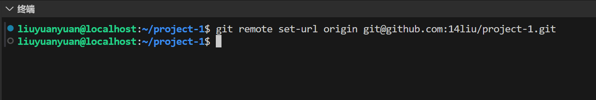
* 在终端使用指令检查远程仓库绑定，如下图所示，结果表明已经绑定成功。
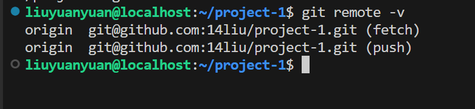

## 5.新建文件/修改文件上传
* 在资源管理器中新建LearningReport.tex文件写入内容并保存。
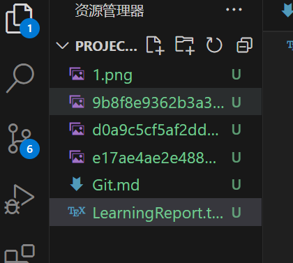
* 打开源代码管理,点击暂存更改 

* 输入提交信息add LearningReport.tex点击提交。 
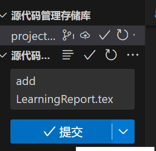
* 点击发布Branch,文件即出现在 GitHub仓库中。
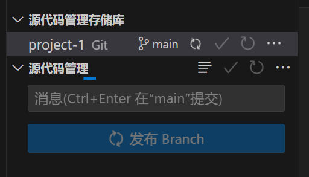
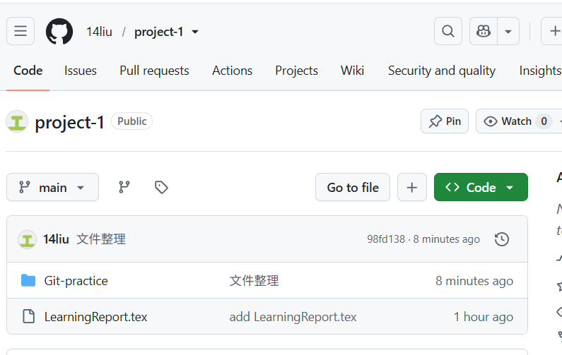
如果想要修改或删除文件，我们可以在资源管理器里面修改，然后在源代码管理里面进行提交即可。

## 6.添加README.md/LICENSE文件
- 添加README.md文件
  - 在vscode上编写好文件。
  - 同5中文件上传操作一致。
- 添加LICENSE文件
  - 点击 Add file → Create new file
  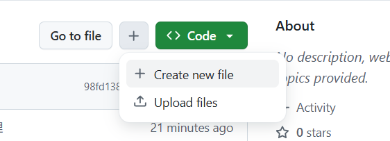
  - 文件名称输入大写：LICENSE（不要加后缀）
  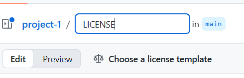
  - 输入文件名之后，页面会出现按钮：Choose a license template
  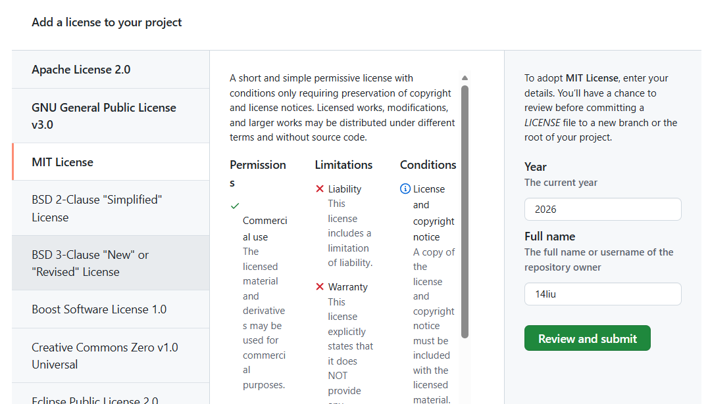
  - 点击按钮，左侧选择协议（MIT），填入名字、年份。点击 Review and submit，提交文件，GitHub 会自动生成完整协议文本。
  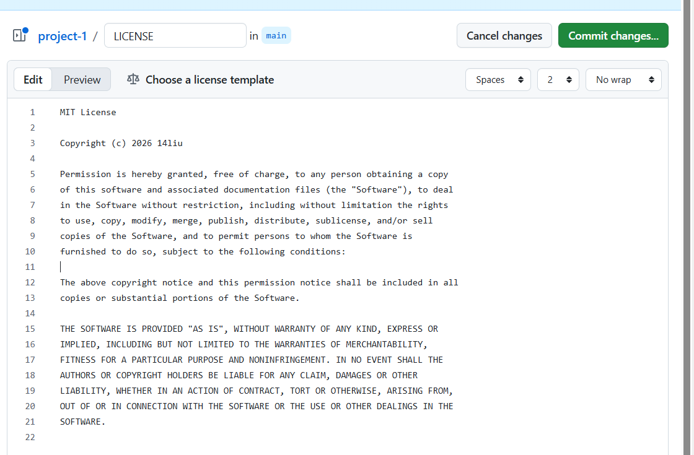
 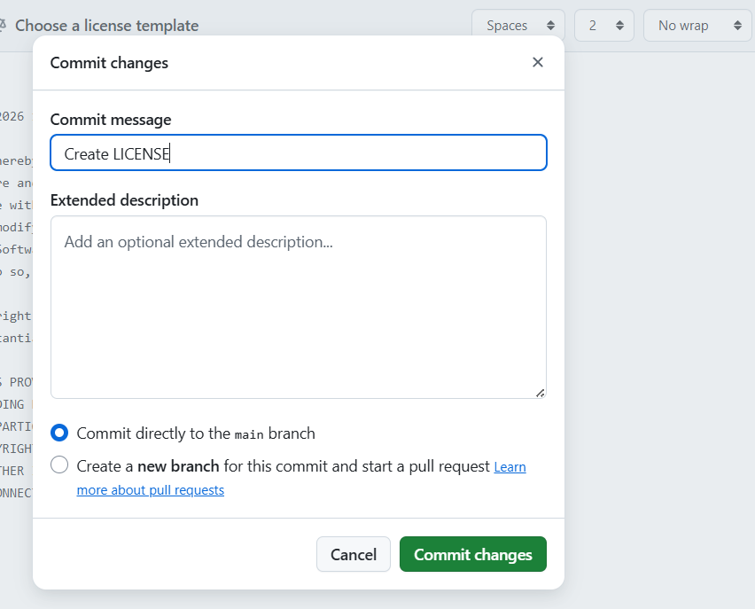